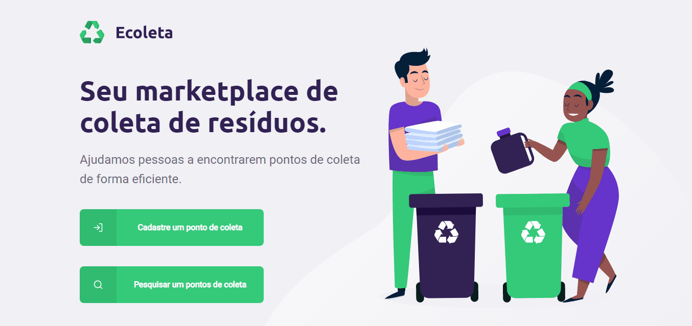

    

<h1 align="center">Ecoleta</h1>

<h3 align="center">🚧 NextLevelWeek 1.0 🚀 In progress.. 🚧</h3>

<h3>♻️ Sobre</h3>

O Ecoleta é um marketplace de coleta de resíduos. Com ele, é possível ajudar as pessoas a encontrarem pontos de coleta de resíduos de forma eficiente.

# 🔖NLW

A aplicação foi construída na trilha booster da Next Level Week distribuída pela <a href="https://rocketseat.com.br/">Rocketseat</a>

# Front-End:

<h3>📷 Screenshot:</h3>

    

<h3>Além do desafio</h3>

💻 Adicionei uma tela de sucesso ao terminar o cadastro.

💻 Adicionei uma página para pesquisar pontos de coletas, caso não tenha pontos cadastrados é retornada uma resposta.

💻 Ao clicar no ponto de coleta, o usuário é levado a uma página com as informações do ponto de coleta.

        

# 🚀 Tecnologias
<ul>
    <li>✔️ Typescript</li>
    <li>✔️ ReactJS</li>
    <li>✔️ React Native</li>
    <li>✔️ Expo</li>
    <li>✔️ NodeJS</li>
    <li>✔️ Knex</li>
    <li>✔️ SQLite</li>
    <li>✔️ Express</li>
    <li>✔️ Axios</li>
</ul>

## 🎓 Quem ministrou?

As aulas foram ministradas pelo <a href="https://github.com/diego3g">Diego Fernandes</a> nas aulas Next Level Week.

<h3 align="center"> Made with 💜 by <a href="https://www.linkedin.com/in/pedro-lucas-4b2941199/">Pedro Lucas</a></h3>